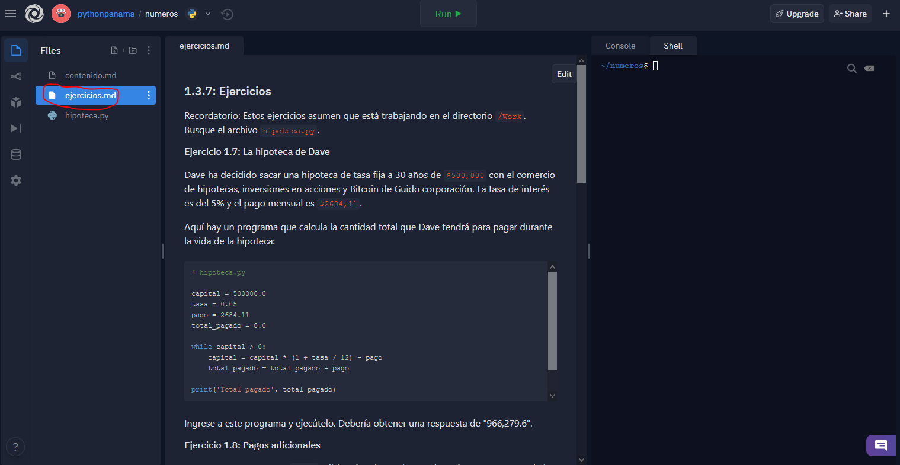
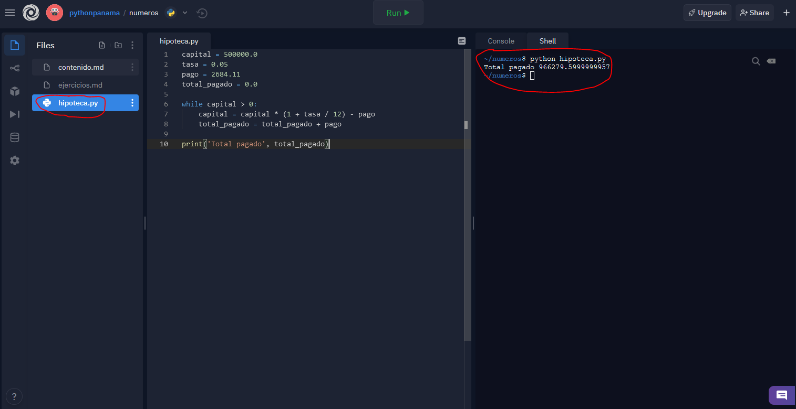
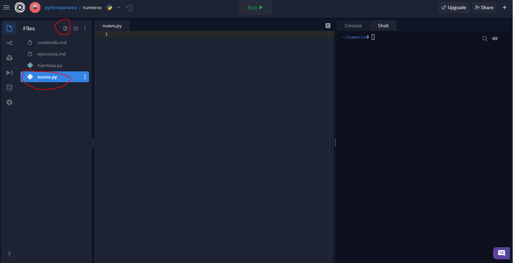
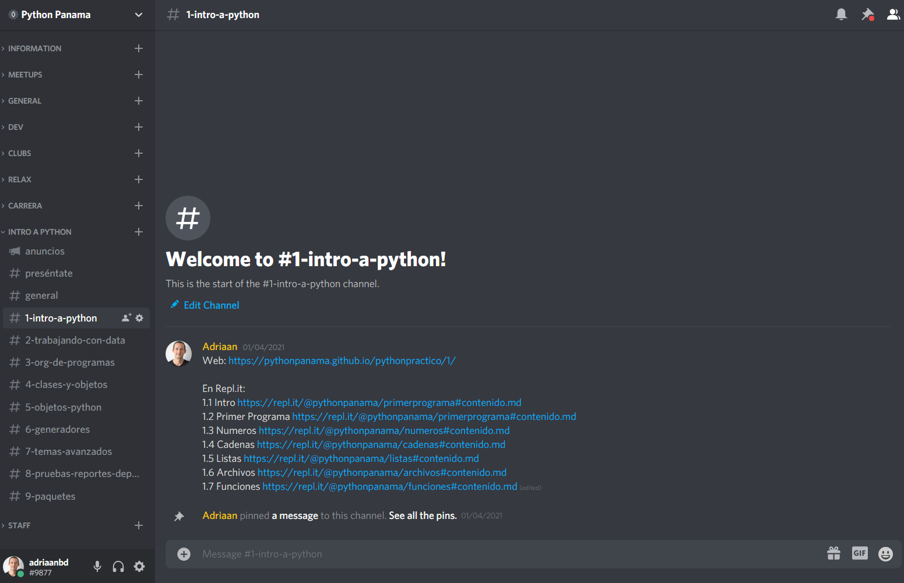

# Empiece aquí

El curso fue originalmente diseñado para que todo lo haga desde su ordenador. Sin embargo, hemos puesto a su disposición en la plataforma [Repl.it](https://repl.it/) un editor, consola Python, terminal Linux y los archivos correspondiente a cada sección, a fin de que pueda escribir y ejecutar código en su navegador. Por tanto, sugerimos crear una cuenta en esta plataforma, a fin de que pueda guardar su trabajo y compartir el enlace cuando necesite ayuda.

Si el curso lo hará desde su ordenador, tendrá que descargar los archivos de trabajo necesarios para completar el curso, [aquí](https://drive.google.com/file/d/1D_cmsxr8OCU3mswbj8ixJIrgbnbcURfS/view?usp=sharing). Además, hemos adjuntado las soluciones [aquí](https://drive.google.com/file/d/1LPcfrZIGCUgqcmh8l-JETOZ4P7bR43Ac/view?usp=sharing).

## Contenido

El enlace a la plataforma interactiva Repl.it con los archivos de la sección correspondiente siempre se encontrarán al inicio del contenido de la sección y al inicio de los ejercicios de cada sección. Usted lee el contenido primero e ingresa las instrucciones Python en la Consola mientras va leyendo.

## Ejercicios

Cuando termine con el `contenido.md`, deberá continuar con el archivo `ejercicios.md`.

## Shell
En muchas ocasiones, usted hará uso de la Consola Python; no obstante, cuando tenga que escribir en un archivo, primero busque el archivo y escriba su código ahí. Cuando tenga que ejecutarlo, tendrá que acceder al **Shell**, como puede ver a continuación. Por ejemplo, si tiene un archivo que se llama `hipoteca.py` tendrá que ejecutar `$ python hipoteca.py` y pulsar Enter.

## Archivos nuevos

Usted también puede crear archivos nuevos.

## Copiar el repositorio

Para que usted tenga una copia propia de su trabajo, tiene que hacer un **Fork**.

## Compartir

En algunas ocasiones tendrá que compartirle el repositorio a alguien, especialmente cuando necesite ayuda. Por tanto, simplemente copie el enlace después de haberle hecho un **Fork**.

## Comunidad

Es importante aprender en público e interactuar con otras personas. En ese sentido, Python Panamá ha puesto a disposición su servidor en Discord, donde el curso tiene su propia categoría organizado por canales, a fin de tener una conversación ordenada. Aquí podrá encontrar a otros Pythonistas que estan tomando este curso o que puedan ayudarles con alguna pregunta.

Puede acceder al servidor de Discord de Python Panama [aqui](https://discord.gg/pR4Qkusugs).

